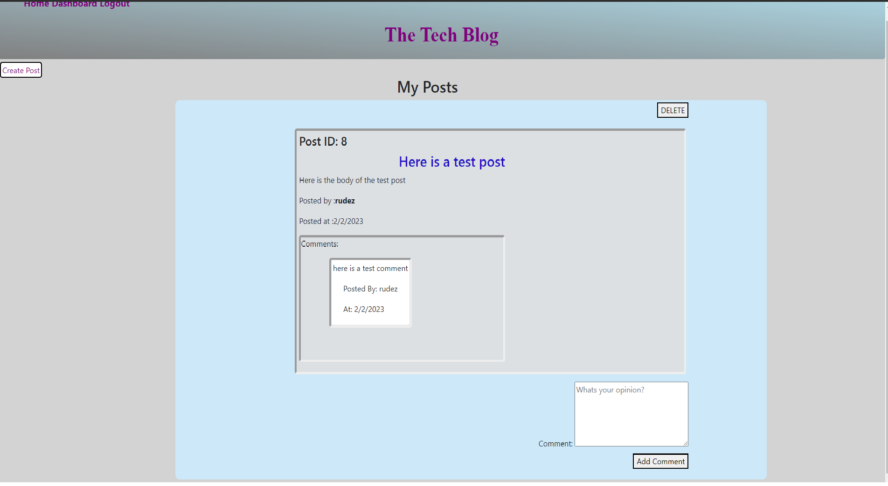
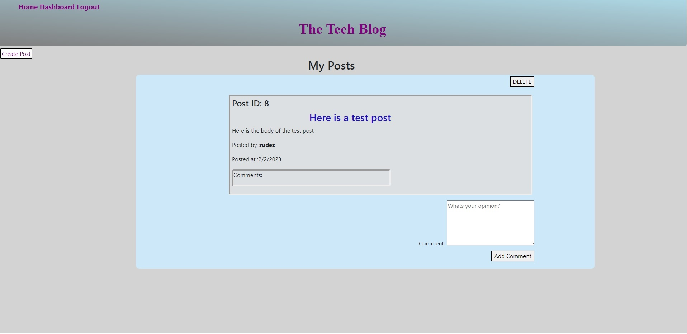

## Tech-Blog
Deployed Website 

https://the-tech-blog.herokuapp.com/login

Repository Website

https://github.com/RudezY/Tech-Blog

## Table of Contents 
  [Description](#description) 
  [Installation-Instructions](#installation-instructions) 
  [Usage-Information](#usage) 
  [Contributing-Guidelines](#contribution) 
  [Testing-Instructions](#tests) 
  [Questions](#questions)

  ## The Title of the Application
Tech-Blog

## Description
This project was created to use handlebars to create a simple blog website. This application uses a Model View Controller (handlebars) to create a template that can be used to render a html template. You are able to create posts, comments, delete and edit your post.

 ## Installation Instructions
You will need to run npm i to install the node modules as well as running a database program such as mysql to view the tables in a different manner.

## Usage
It can be used as a basic template for creating a blog style website.

 ## Contribution
 n/a

 ## Tests
 n/a

## Questions
If you have any questions you can reach out to me at RudezY on github

